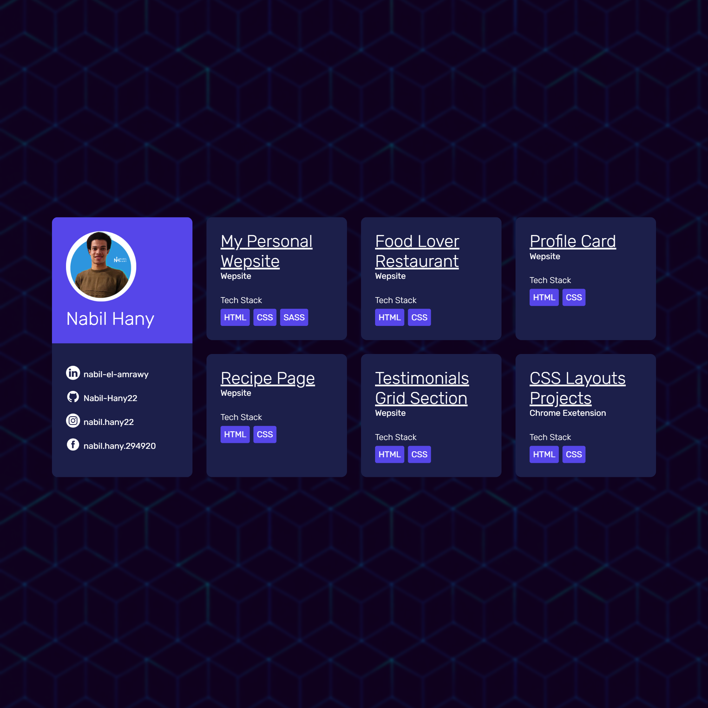
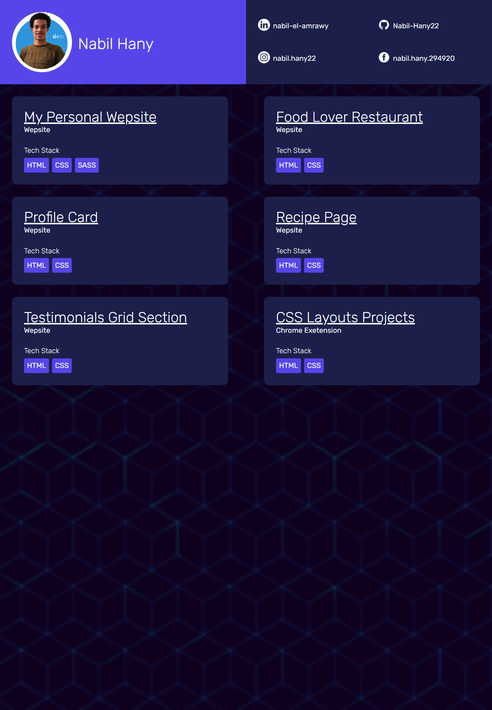
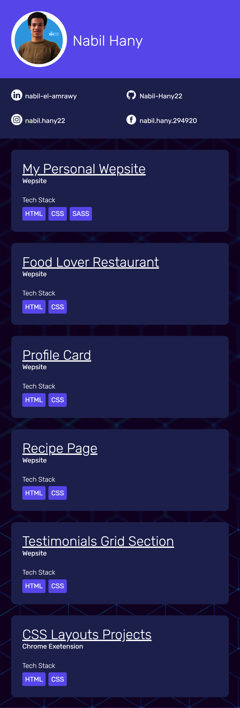

# 🌟 Mini-Portfolio-Showcase  

A compact personal portfolio displaying my profile and a selection of recent small-scale web projects.  
The goal of this project is to practice **HTML** and **CSS** with a focus on **responsive design** across different devices.  

---

## 🚀 Live Demo

Check out the live version of the project here:  
👉 [Mini-Portfolio-Showcase Live Demo](https://nabil-hany22.github.io/Mini-Portfolio-Showcase/)

---
## 📸 Preview  

### 🖥️ Desktop Version  
<p align="center">
  
</p>

### 📱 Tablet Version  
<p align="center">
  
</p>

### 📲 Mobile Version  
<p align="center">
  
</p> 

---

## 🛠️ Features  

- Responsive design (Desktop, Tablet, Mobile).  
- Profile card displaying personal info and social links.  
- Project showcase with links to repositories.  
- Organized file structure with `assets` for icons/images, `styles` for SCSS/CSS, and `preview` for screenshots.  

---

## 📂 Project Structure  

```
Mini-Portfolio-Showcase/
│── assets/              # images, icons, backgrounds
│── preview/             # screenshots (desktop, tablet, mobile)
│── styles/              # SCSS & CSS files
│   ├── _mixins.scss
│   ├── style.css
│   ├── style.css.map
│   └── style.scss
│── index.html           # main HTML file
└── README.md            # project documentation
```

---

## 🚀 Tech Stack  

- **HTML5**  
- **CSS3**  
- **SCSS (Sass)**  

---

## 📬 Connect with Me  

- [LinkedIn](https://www.linkedin.com/in/nabil-el-amrawy/)  
- [GitHub](https://github.com/Nabil-Hany22)  
- [Instagram](https://www.instagram.com/nabil.hany22/)  
- [Facebook](https://www.facebook.com/nabil.hany.294920)  

---

💡 *Feel free to check out the live demo and share your feedback!*  
